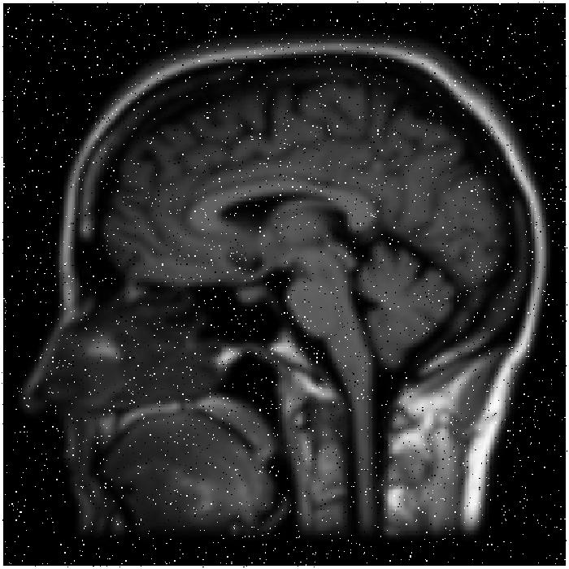

# Image Processing Project: Noise Removal, Sharpening, and Histogram Equalization

This MATLAB project demonstrates a series of image processing techniques to improve an image by removing salt-and-pepper noise, sharpening the image, removing sharpening artifacts, and applying histogram equalization.

## Project Overview

This project is divided into four stages:

1. **Stage 1: Remove Salt and Pepper Noise**
   - The input image with salt-and-pepper noise is processed using a median filter to remove the noise.

2. **Stage 2: Sharpen the Image**
   - A Laplacian filter is applied for image sharpening, followed by an adjustment to enhance the sharpness using a factor.

3. **Stage 3: Remove Sharpening Artifacts**
   - After sharpening, the image may exhibit some artifacts. A median filter is applied again to remove any remaining noise introduced during sharpening.

4. **Stage 4: Histogram Equalization**
   - The image is converted to grayscale (if it is not already) and histogram equalization is applied to improve the image's contrast.

## Project Files

- `input_1.png`: The input image with salt-and-pepper noise.
- `image_processing.m`: The main script that performs all stages of the image processing.

## Requirements

This project is implemented in MATLAB. Ensure you have the following MATLAB toolboxes:

- Image Processing Toolbox

## Steps to Run the Code

1. Clone the repository to your local machine or download the project files.
2. Make sure the input image (`input_1.png`) is located in the same directory as the script or update the path in the script to the location of your image.
3. Run the `image_processing.m` script in MATLAB. The script will process the image through four stages:
   - Stage 1: Salt-and-pepper noise removal using a median filter.
   - Stage 2: Image sharpening with the Laplacian filter.
   - Stage 3: Removal of sharpening artifacts using a median filter.
   - Stage 4: Histogram equalization to enhance the contrast.
4. View the intermediate results after each stage and the final processed image.

## Example

### Original Image:

### Final Processed Image:
- The final image will have reduced noise, improved sharpness, and enhanced contrast after histogram equalization.
